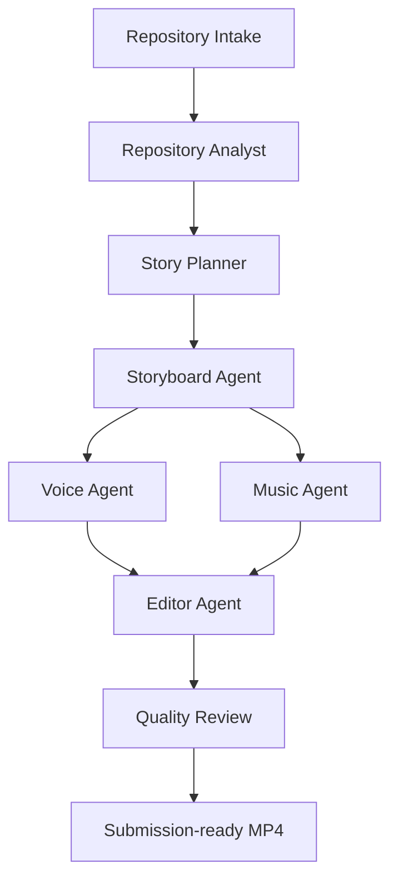

# RepoReel

> Turn a GitHub repository into a polished 60–90 second product demo.

RepoReel is an agentic video-production pipeline for hackathon teams and open-source developers. Give it a repository, screenshots, and optional branding; it researches the project, finds the story, plans the scenes, creates narration, and assembles a submission-ready demo video.

## Why RepoReel?

Great projects often lose attention because explaining them takes longer than building them. RepoReel turns the evidence already living in a repository into a concise, cinematic product story.

## The workflow



The pipeline can:

- clone and inspect a GitHub repository
- understand the README, stack, releases, commits, and assets
- identify the product’s strongest user-facing features
- ask for missing screenshots or branding
- write a concise narrative and scene-by-scene storyboard
- generate voiceover and background music
- assemble scenes, captions, and transitions
- review the result and export an MP4

## Project status

RepoReel is an early-stage hackathon prototype. The first milestone is a narrow, reliable path from a public GitHub URL to a storyboard and rendered demo video.

## Repository layout

```text
agents/       Pipeline agents and orchestration
assets/       Branding and reusable visual assets
backend/      API, job management, and media pipeline
docs/         Architecture and workflow documentation
examples/     Sample projects and generated outputs
frontend/     Upload, progress, and review interface
prompts/      Versioned prompts used by agents
```

## Quick start

The implementation is being built in stages. For now, explore the design docs:

- [Architecture](docs/architecture.md)
- [Workflow](docs/workflow.md)

## Roadmap

- [ ] Repository intake and project fact extraction
- [ ] Narrative and storyboard generation
- [ ] Screenshot and screen-recording scene support
- [ ] Voiceover generation
- [ ] Timeline assembly and MP4 export
- [ ] Quality review with human approval checkpoints
- [ ] Hosted demo for hackathon submissions

## Contributing

Issues and pull requests are welcome. If you are experimenting with a new agent, prompt, or media adapter, document the input/output contract so the pipeline stays composable.

## License

MIT. See [LICENSE](LICENSE).
