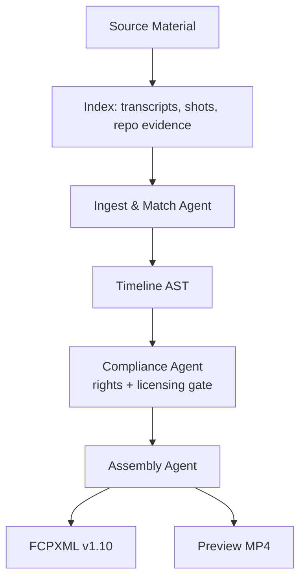

# Last Minute Studio

> Turn your project into a pitch-ready demo before the deadline.

Last Minute Studio is an agentic **editorial assembly** pipeline for hackathon teams and open-source developers. Give it a brief and your source material — repository evidence, screen recordings, screenshots, licensed clips — and it indexes that material, matches it to your story, clears the rights, and assembles a cut. You get a **preview video** you can watch immediately and an **FCPXML** timeline an editor can finish in Final Cut.

It assembles real evidence rather than generating imagery. See [the concept doc](docs/concept-studiodesk.md) for why that bet was made.

## Why Last Minute Studio?

Great projects often lose attention because explaining them takes longer than building them. Last Minute Studio turns the evidence already living in a repository into a concise, cinematic product story.

## The workflow



The pipeline can:

- clone and inspect a GitHub repository, and index screen recordings and clips
- understand the README, stack, releases, commits, and assets
- identify the product’s strongest user-facing features
- ask for missing screenshots or branding
- write a concise narrative and match each line to real source material
- clear every asset for rights and licensing before it is used
- assemble a timeline with captions, transitions, and Google-generated narration
- export both an FCPXML timeline and a preview MP4

## Project status

Last Minute Studio is an early-stage hackathon prototype. The first milestone is a narrow, reliable path from a public GitHub URL to a storyboard and rendered demo video.

## Repository layout

```text
agents/       Pipeline agents and orchestration
assets/       Branding and reusable visual assets
backend/      API, job management, and media pipeline
docs/         Architecture and workflow documentation
examples/     Sample projects and generated outputs
frontend/     Upload, progress, and review interface
prompts/      Versioned prompts used by agents
```

## Quick start

The implementation is being built in stages. For now, explore the design docs:

- [Architecture](docs/architecture.md)
- [Workflow](docs/workflow.md)

## Roadmap

- [ ] Source-material intake and indexing (repo evidence, recordings, transcripts)
- [ ] Ingest & Match agent → Timeline AST
- [ ] Compliance agent: rights and licensing gate
- [ ] Assembly agent: FCPXML v1.10 export
- [ ] FFmpeg preview MP4 from the same AST
- [ ] Human approval checkpoint before assembly
- [ ] Hosted demo with a no-login judge path

## Contributing

Issues and pull requests are welcome. If you are experimenting with a new agent, prompt, or media adapter, document the input/output contract so the pipeline stays composable.

## License

MIT. See [LICENSE](LICENSE).
